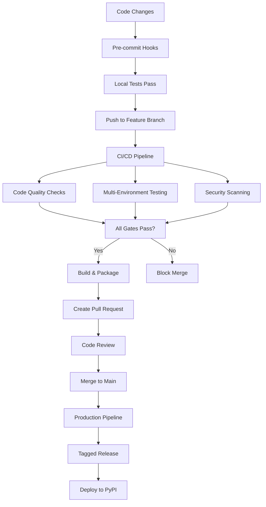

## CI/CD Implementation

### Introduction
CI/CD represents the backbone of modern software development workflows, automating the journey from code changes to production deployment. While pre-commit hooks provide immediate feedback during development, CI/CD creates comprehensive quality gates that protect your main branch and automate release processes.

### Purposes

**Why CI/CD is Essential:**
- **Quality Assurance**: Automatically run comprehensive tests across multiple environments
- **Early Bug Detection**: Catch integration issues before they reach production
- **Consistent Builds**: Ensure reproducible builds across different environments  
- **Automated Deployment**: Reduce human error in release processes
- **Team Collaboration**: Provide shared visibility into build status and quality metrics

**What CI/CD Provides:**
- **Continuous Integration (CI)**: Automated testing, linting, and building on every code change
- **Continuous Deployment (CD)**: Automated deployment to staging/production environments
- **Quality Gates**: Coverage thresholds, security scans, and performance checks
- **Artifact Management**: Build and store distributable packages
- **Notification Systems**: Alert teams about build failures or successful deployments

**When to Use CI/CD:**
- **Every repository**: Essential for professional development workflows
- **Team projects**: Critical for coordination and quality assurance
- **Production systems**: Mandatory for reliable deployment processes
- **Open source projects**: Provides transparency and builds trust with contributors

### Pipeline Stages

Our CI/CD pipeline includes the following stages:

1. **Code Quality Checks**: Linting, formatting, type checking
2. **Testing**: Unit tests, integration tests, coverage analysis
3. **Security Scanning (Optional)**: Dependency vulnerability checks
4. **Build**: Package creation and validation
5. **Release**: Automated deployment to staging/production
6. **Report**: Aggregate results of all stages and reporting

### CI/CD Workflow Example

Our GitHub Actions workflow (`.github/workflows/ci.yml`) implements the following professional pipeline:

```yaml
# Trigger on pushes to main/develop and all pull requests
on:
  push:
    branches: [ main, develop ]
  pull_request:
    branches: [ main ]
```

**Pipeline Jobs:**

1. **🔍 Code Quality Checks** (`code-quality`)
   <!-- - Ruff formatting check: `ruff format --check --diff .` -->
   - Ruff linting: `ruff check --output-format=github .`
   - MyPy type checking: `mypy src/ --install-types --non-interactive`
   - Docstring validation: `docformatter --check --recursive src/`

2. **🧪 Test Suite Matrix** (`test`)
   - Multi-version testing: Python 3.9, 3.10, 3.11
   - Multi-OS testing: Ubuntu, Windows, macOS  
   - Coverage analysis: `pytest --cov=src --cov-fail-under=80`
   - Coverage reporting: XML, HTML, JSON formats
   - Upload to Codecov for analysis

3. **🔒 Security Scanning (Optional)** (`security`)
   - Dependency vulnerabilities: `safety check`
   - Static code analysis: `bandit -r src/`
   - Security report artifacts

4. **🏗️ Build & Package** (`build`)
   - Create wheel and source distributions: `python -m build`
   - Validate packages: `twine check dist/*`
   - Store artifacts for deployment

5. **🚀 Deployment** (`deploy`)
   - Conditional: Only on tagged releases (`refs/tags/v*`)
   - Deploy to PyPI: `pypa/gh-action-pypi-publish@release/v1`
   - Protected environment with manual approval

6. **📊 Reporting** (`report`)
   - Aggregate pipeline results
   - Generate summary with metrics
   - Provide actionable failure insights

### Coverage Integration in CI/CD

**Why Coverage Belongs in CI/CD (Not Pre-commit):**
- **Comprehensive Analysis**: CI/CD runs full test suite across multiple environments
- **Quality Gates**: Prevents merging code below coverage thresholds
- **Historical Tracking**: Monitors coverage trends over time
- **Team Visibility**: Shared coverage reports for all contributors
- **Performance**: Avoids slowing down individual commits

**Coverage Commands:**
```bash
# Basic coverage report
pytest --cov=src tests/

# Detailed coverage with missing lines
pytest --cov=src --cov-report=term-missing tests/

# Generate HTML report for detailed analysis
pytest --cov=src --cov-report=html tests/

# Fail if coverage below threshold
pytest --cov=src --cov-fail-under=80 tests/

# Generate all report formats (CI/CD)
pytest --cov=src --cov-report=term-missing --cov-report=xml --cov-report=html tests/
```

### Professional CI/CD Best Practices

**Quality Gates:**
- ✅ All code quality checks must pass
- ✅ Test coverage must meet 80% threshold
- ✅ Security scans must show no high-severity vulnerabilities
- ✅ All tests must pass across Python versions
- ✅ Package build must succeed

**Branch Protection:**
- Require status checks before merge
- Require up-to-date branches
- Require linear history
- Restrict pushes to main branch

**Deployment Strategy:**
- **Feature branches**: Run full CI pipeline
- **Pull requests**: Run CI + security scans
- **Main branch**: Run CI + build artifacts
- **Tagged releases**: Run CI + deploy to production

**Monitoring and Alerts:**
- Build status notifications via email/Slack
- Coverage reports uploaded to Codecov
- Security vulnerability alerts
- Deployment status notifications

### CI/CD vs Pre-commit Comparison

| Aspect | Pre-commit | CI/CD |
|--------|------------|-------|
| **Purpose** | Fast feedback | Comprehensive validation |
| **Scope** | Changed files only | Entire codebase |
| **Environment** | Developer machine | Controlled CI environment |
| **Speed** | Very fast (< 30s) | Slower but thorough (5-15 min) |
| **Coverage** | Basic checks | Full test suite + coverage |
| **Security** | Basic linting | Comprehensive vulnerability scans |
| **Testing** | Quick validation | Multi-environment matrix testing |
| **Deployment** | None | Automated deployment pipeline |

### Benefits of This CI/CD Implementation

**For Developers:**
- Immediate feedback on code quality issues
- Confidence in code changes across environments
- Automated testing prevents integration issues
- Clear coverage metrics guide testing efforts

**For Teams:**
- Consistent code quality standards
- Shared visibility into build status
- Automated deployment reduces errors
- Historical tracking of quality metrics

**For Projects:**
- Reliable release process
- Security vulnerability monitoring
- Package distribution automation
- Professional development workflow

**Manual CI/CD testing:**
```bash
# Test individual pipeline stages locally
pre-commit run --all-files          # Local quality checks
pytest --cov=src tests/             # Local testing with coverage
python -m build                     # Local package building
twine check dist/*                  # Validate packages
```

## Summary: Complete Python Template Project

Your template now includes **4 major professional techniques**:

### 🚀 **Technique Timeline:**
1. **pip-compile**: Dependency management with pinned versions
2. **pyproject.toml**: Build system and tool configuration  
3. **pre-commit**: Local quality gates and fast feedback
4. **CI/CD**: Comprehensive automation and deployment

### 📁 **Project Structure:**
```
python-template-project/
├── .github/workflows/ci.yml         # Complete CI/CD pipeline
├── .pre-commit-config.yaml          # Pre-commit hooks
├── pyproject.toml                   # Build & tool configuration  
├── requirements/
│   ├── dev-requirements.in          # High-level dependencies
│   └── dev-requirements.txt         # Pinned dependencies
├── src/my_package/
│   └── calculator.py                # Example code with 100% coverage
├── tests/
│   ├── test_calculator_good_coverage.py    # Comprehensive testing
│   └── test_calculator_poor_coverage.py    # Coverage comparison
└── README.md                        # Complete documentation
```

### ⚡ **Workflow Integration:**


This template provides a **production-ready foundation** for any Python project with automated quality assurance, comprehensive testing, security scanning, and deployment capabilities. Each technique builds upon the previous ones to create a robust, professional development workflow.